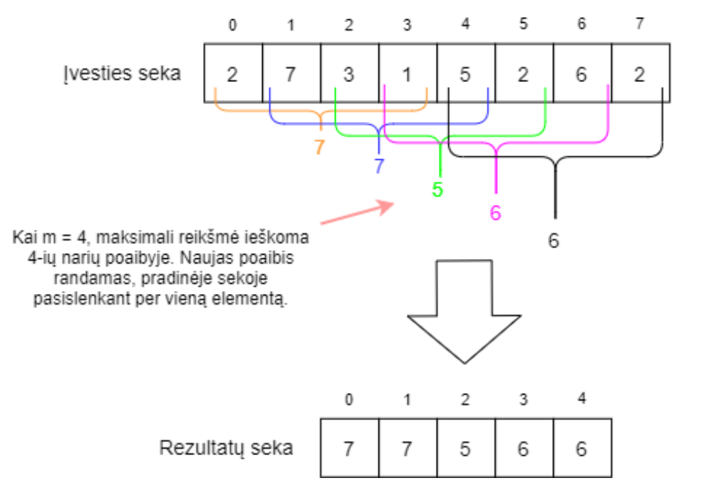

# LD1 užduotis

## LD1 privalomoji dalis (6 balai)
1. Išsiaiškinkite projekte `Lab1b_BendriniaiSarasai` esantį programinį kodą.
2. Realizuokite nerealizuotus projekto `Lab1b_BendriniaiSarasai` metodus ir juos ištestuokite. **(2 balai)**
3. Sukurkite sąsają `Stack<E>`, kuri turėtų šiuos abstrakčius metodus:
    * `E pop()` - pirmo elemento esančio steke ištrynimui ir grąžinimui.
    * `void push(E item)` – naujo elemento įterpimui į steko pradžią.
    * `E peak()` – pirmo elemento esančio steke grąžinimui.
    * `boolean isEmpty()` – patikrinimui, ar stekas tuščias
4. Sukurkite dvi klases: `ArrayStack<E>` ir `LinkedListStack<E>`. 
Abi šios klasės turi realizuoti sąsają `Stack<E>`. 
`ArrayStack<E>` realizuoja steko duomenų struktūrą masyvo pagrindu (masyvo realizacijai galima naudoti
Java kolekcijos klasę `ArrayList<E>`), `LinkedListStack<E>` realizuoja steko duomenų struktūrą susietojo sąrašo pagrindu
(realizacijai galima naudoti `Lab1b_BendriniaiSarasai` esančia bendrinę `LinkedList` klasę arba Java kolekcijos klasę `LinkedList<E>`). Ištestuokite šių duomenų struktūrų operacijas. **(2 balai)**
5. Sukurkite sąsają `Queue<E>`, kuri turėtų šiuos abstrakčius metodus:
    * `void enqueue(E item)` – naujo elemento pridėjimui į eilės galą.
    * `E dequeue()` – pirmojo eilėje esančio elemento ištrynimui ir grąžinimui.
    * `E peak()` – pirmojo eilėje esančio elemento grąžinimui.
    * `boolean isEmpty()` – patikrinimui, ar eilė tuščia.
6. Sukurkite dvi klases: `ArrayQueue<E>` ir `LinkedListQueue<E>`. 
Abi šios klasės turi realizuoti sąsają `Queue<E>`.
`ArrayQueue<E>` realizuoja eilės duomenų struktūrą masyvo pagrindu (masyvo realizacijai galima naudoti
sisteminę Java kolekcijos klasę `ArrayList<E>`), `LinkedListQueue<E>` realizuoja eilės duomenų struktūrą susietojo
sąrašo pagrindu (realizacijai galite naudoti `Lab1b_BendriniaiSarasai` esančią bendrinę `LinkedList` klasę arba 
Java kolekcijos klasę `LinkedList<E>`). Ištestuokite šių duomenų struktūrų operacijas. **(2 balai)**

## LD1 neprivalomoji dalis (2 balai)
Išspręskite šiuos uždavinius:
### **Uždavinys 1 (1 balas).** 
Turime N (0 < N <= 1000) ilgio simbolių eilutę susidedančia iš šių
simbolių sekos: „{“, „(“, „[“, „]“, „)“ ir „}“. Simbolių eilutė turi būti subalansuota, t.y. kiekvienas
iš eilės einantis skliaustelius atidarantis simbolis „{“, „(“ arba „[“ turi turėti atitinkamą skliaustelius
uždarantį simbolį „}“, „)“ arba „]“. Parašykite algoritmą, kuris galėtų patikrinti, ar įvesta N ilgio 
simbolių eilutė yra subalansuota – ar kiekvienas skliaustelius atidarantis simbolis turi save 
atitinkantį skliaustelius uždarantį simbolį. Vieno tipo skliaustelių viduje negali būti
nesubalansuotų kito tipo skliaustelių (pvz. simbolių eilutė „{(})“ yra nesubalansuota, nes tarp
„{}“ ir „()“ yra nesubalansuota seka).

Algoritmo asimptotinis sudėtingumas turėtų neviršyti O(n)

Duomenų pavyzdžiai:
| Įvesti       | Išvestis |
| ------------ | -------- |
| "}"          | False    |
| “{()}{[]}”   | True     |
| “[{}}”       | False    |
| “{()[{}]}{}” | True     |
| “{(})”       | False    |
| „([(]{)})“   | False    |

### **Uždavinys 2 (1 balas).
Duotas skaičius n (1 ≤ n ≤ 105), nurodantis skaičių sekos ilgį. 
Duota skaičių seka 𝑎1, 𝑎2, … , 𝑎𝑛 ir skaičius m (1 ≤ m ≤ n), nurodantis lango ilgį. 
Raskite maksimalią reikšmę kiekviename poslinkio lange. Žemiau pateiktas pavyzdys, kai m = 4:

Šio uždavinio naivaus sprendimo asimptotinis sudėtingumas yra O(nm).
**Jums reikia realizuoti algoritmą, kuris užtikrintų O(n) asimptotinį sudėtingumą.**

Duomenų pavyzdžiai:
| Įvestis           	| Išvestis          	|
|-------------------	|-------------------	|
| k = 4             	| [7 7 5 6 6]       	|
| [2 7 3 1 5 2 6 2] 	|                   	|
| k = 1             	| [2 7 3 1 5 2 6 2] 	|
| [2 7 3 1 5 2 6 2] 	|                   	|
| k = 8             	| [7]               	|
| [2 7 3 1 5 2 6 2] 	|                   	|

