# L2 užduotis

## L2 privalomoji dalis
1. Išnagrinėkite `Lab2_AibesMedziai` projekte pateiktą programinį kodą.

2. **(5 balai)** Realizuokite nerealizuotus programinio kodo metodus ir juos ištestuokite (testus galite inicijuoti tiek per projekto vartotoho sąsają, tiek per konsolę).  
Klasėje `BstSet` reikia realizuoti šiuos metodus:
* `remove(E element);`
* `removeRecusive(E element, BstNode<E> node)` - pagalbinis `remove` metodas.
* Iteratoriaus metodą `remove();`
* `addAll(Set<E> set)` - patalpinti visus `set` elementus į aibę, jeigu abi aibės turi tą patį elementą jis nėra dedamas.
* `containsAll(Set<E> set)` - patikrinti ar aibėje egzistuoja visi elementai, esantys aibėje `set`.
* `retainAll(Set<E> set)` - ištrinti elementus, kurių nėra aibėje `set`.
* `headSet(E e)` - grąžinamas aibės poaibis iki elemento `e`.
* `tailSet(E e)` - grąžinamas aibės poaibis nuo elemento `e`.
* `subSet(E element1, E element2)` - grąžinamas aibės poaibis nuo elemento `element1` iki `element2`.  

***

Klasėje `AvlSet` reikia realizuoti šiuos metodus:
* `remove();`
* `removeRecursive(E element, BstNode<E> node)` - pagalbinis `remove` metodas.  

3. **(3 balai)** Atlikite greitaveikos testavimą (naudokite JMH) su viena metodų pora iš žemiau pateiktos lentelės:

| **Variantas** 	| **Metodas 1**                 	| **Metodas 2**                            	|
|---------------	|-------------------------------	|------------------------------------------	|
| 1             	| `Class BstSet: remove()`      	| `Class AvlSet: remove()`                 	|
| 2             	| `Class BstSet: contains()`    	| `Class AvlSet: contains()`               	|
| 3             	| `Class BstSet: containsAll()` 	| `Class AvlSet: containsAll()`            	|
| 4             	| `Class BstSet: addAll()`      	| `Class AvlSet: addAll()`                 	|
| 5             	| `Class BstSet: retainAll()`   	| `Class AvlSet: retainAll()`              	|
| 6             	| `Class BstSet: remove()`      	| `Class java.util.TreeSet<E>: remove()`   	|
| 7             	| `Class BstSet: contains()`    	| `Class java.util.TreeSet<E>: contains()` 	|
| 8             	| `Class AvlSet: remove()`      	| `Class java.util.TreeSet<E>: remove()`   	|
| 9             	| `Class AvlSet: contains()`    	| `Class java.util.TreeSet<E>: contains()` 	|

**Duotas greitaveikos testavimo variantas: 5**

__Laisva forma parenkite atskaitą. Ataskaitoje turi būti:__
1. Aprašyti tiriamieji metodai.
2. Pateiktas tiriamųjų metodų asimptotinis sudėtingumas.
3. Aprašyta greitaveikos testavimo metodika (testavimo algoritmas).
4. Aprašomi kompiuterio, su kuriuo buvo atlikti greitaveikos testai, pagrindiniai parametrai
(procesoriaus chrakteristikos, atminties kiekis ir pan.).
5. Algoritmų/metodų vykdymo laiko priklausomybės nuo įvesties duomenų kiekio grafikas.
6. Išvados. Išvadose lasiva forma turėtų būti pateikti atsakymai į šiuos klausimus:
    * Ar eksperimentiškai nustatyta vykdymo laiko priklausomybė nuo įvesties dydžio atitinka teorinį algoritmo/metodo asimptotinį sudėtingumą. Jei ne, kodėl?
    * Kurie iš tirtųjų metodų vykdymo laiko požiūriu yra geresni. Kodėl?

## L2 neprivalomoji dalis
Išspręskite šiuos uždavinius:

1. **(1 balas)** Turime dvejetainį paieškos medį su jūsų pasirinktais duomenimis (medyje saugomas
objektas turi realizuoti sąsąją `Comparable`). Patikrinkite, ar medžio šakų balansas neviršija sveikojo skaičiaus k(k> -1). Pavyzdys, jeigu k = 2:
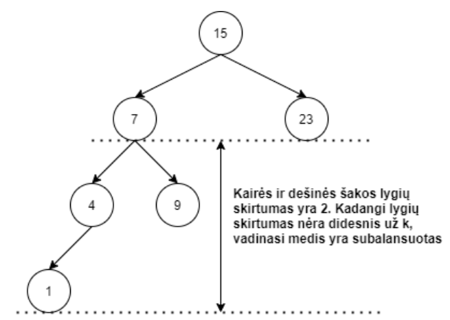

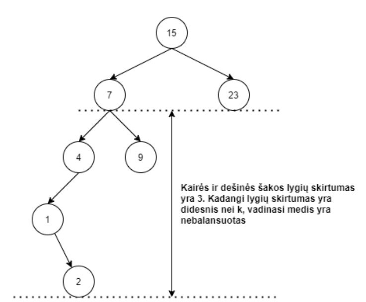

Įvesties duomenys:
* Skaičius *k*
* Dvejetainis paieškos medis

Parašykite algoritmą, kuris nustatytų, ar duotasis paieškos medis yra subalansuotas pagal
parametrą *k*. Algoritmo asimptotinis sudėtingumas turi neviršyti *O(n)*.

2. **(1 balas)** Turime pilnąjį dvejetainį medį. Parašykite algoritmą, kuris rastų medžio vidinius mazgus, t.y. mazgus, esančius medžio perimetro viduje. Pavyzdys:  
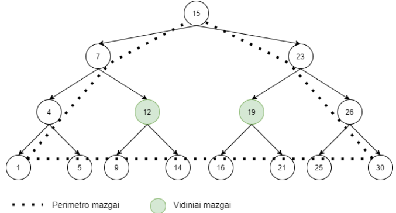

## LD2 gynimas
Gynimo metu dėstytojai gali studentų prašyti atlikti žemiau pateiktas užduotis ir atsakyti į
žemiau pateiktus klausimus. __Klausimų ir užduočių sąrašas nėra baigtinis - dėstytojai gynimo metu
gali užduoti su tema susijusių praktinių užduočių, kurių nėra šiame sąraše.__

### Galimos praktinės užduotys iš privalomosios dalies
Realizuokite vieną ar kelis metodus iš šio sąrašo:
| **Gražinama reikšmė** | **Metodo aprašymas**                                                                                                                  |
|-----------------------|---------------------------------------------------------------------------------------------------------------------------------------|
| boolean               | `removeAll(BstSet<?> c)` Removes from this set all of its elements that are contained in the specified collection                     |
| E                     | `ceiling(E e)` Returns the least element in this set greater than or equal to the given element, or null if there is no such element. |
| E                     | `floor(E e)` Returns the least element in this set strictly greater than the given element, or null if there is no such element.      |
| E                     | `higher(E e)` Returns the least element in this set strictly greater than the given element, or null if there is no such element.     |
| E                     | `last()` Returns the last (highest) element currently in this set.                                                                    |
| E                     | `lower(E e)` Returns the greatest element in this set strictly less than the given element, or null if there is no such element.      |
| E                     | `pollFirst()` Retrieves and removes the first (lowest) element, or returns null if this set is empty.                                 |
| E                     | `pollLast()` Retrieves and removes the last (highest) element, or returns null if this set is empty.                                  |
| `SortedSet<E>`        | `copyOf(BstSet<? extends E> set)` Returns a Set containing the elements of the given set                                              |                                        	

### Galimos praktinės užduotys iš neprivalomosios dalies
1. Parašykite algoritmą, kuris patikrintų, ar duotasis dvejetainis medis yra dvejetainis
paieškos medis.
2. Parašykite metodą, kuris konvertuotų masyvą į balansuotą dvejetainį paieškos medį.
3. Parašykite metodą, kuris konvertuotų dvejetainį paieškos medį į vienkryptį
susietąjį sąrašą.
4. Parašykite metodą, kuris leistų iteruoti per medį išilgai jo lygių.
5. Parašykite metodą, kuris leistų iteruoti per medį vertikaliais sluoksliniais nuo viršaus į apačią.
6. Išspausdinkite dvejetainio paieškos medžio lapus.
7. Duoti du medžio mazgai, raskite ir išspausdinkite trumpiausią kelią tarp šių mazgų.
8. Raskite ir išspausdinkite visus dvejetainio paieškos medžio kelius nuo šaknies iki lapo.
9. Duota skaičius, nustatykite, ar dvejetainiame paieškos medyje egzistuoja toks kelias,
kurio mazgų raktų suma yra lygi duotajam skaičiui.
10. Perrašykite vieną iš pagrindinių medžio operacijų nenaudodami rekusijos.

### Galimi teoriniai klausimai
1. Koks yra įvairių lavoratoriniame darbe realizuotų operacijų asimptotnis sudėtingumas?
2. Kokie yra dvejetainio paieškos medžio bei balansuoto dvejetainio paieškos medžio
privalumai ir trūkumai?
3. Mokėkite paaiškinti įvairius su programiniu kodu susijusius niuansus.

## AVL medžio testavimas
Sukuriami automobilių klasės objektai iš eilės nuo `c1` iki `c18`. Jie sudedami į medį tokia
eilės tvarka:

*c9, c7, c8, c16, c17, c18, c11, c5, c1, c6, c2, c10, c3, c4, c15, c12, c13, c14*

Sukurtas medis atrodo taip:

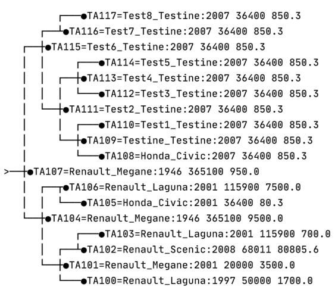

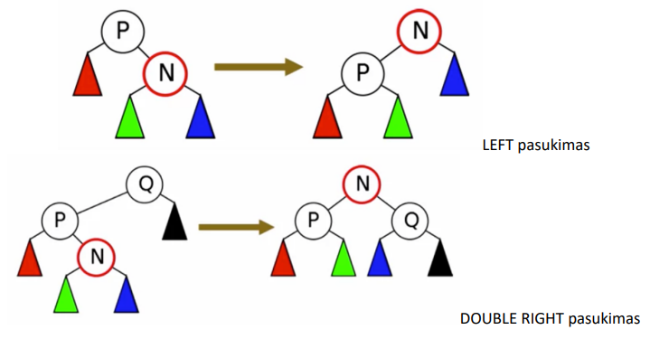

#### LEFT pasukimo testavimas
Ištrinamas *c1* elementas ir gautas medis atrodo taip:

#### DOUBLE LEFT pasukimas
Ištrinami *c15, c11, c10, c9* elementai ir gautas medis atrodo taip:

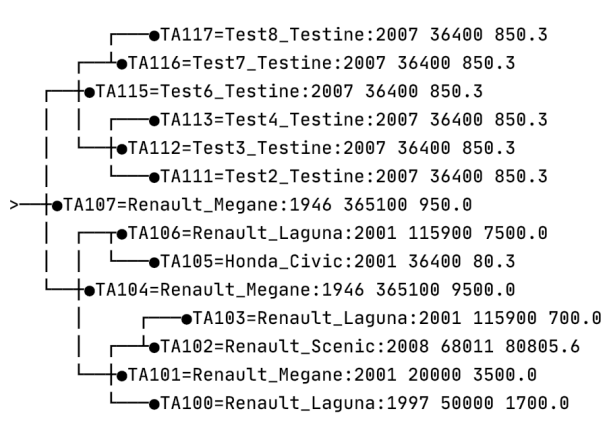

#### RIGHT pasukimas
Ištrinami *c11, c13, c15, c14* elementai ir gautas medis atrodo taip:

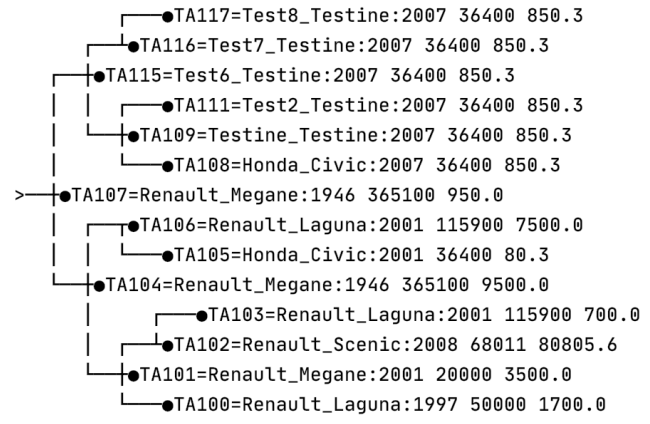

#### DOUBLE RIGHT pasukimas
Ištrinamas *c6* elementas ir gautas medis atrodo taip:

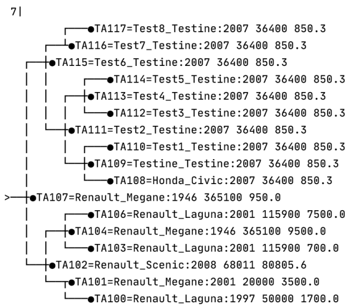

***

### Papildomai (priklauso nuo realizacijos)

#### DOUBLE RIGHT pasukimas
Ištrinamas *c5* elementas, jei ištrintas elementas pakeičiamas __dešiniojo pomedžio
mažiausiu elementu__, gautas medis po pasukimo atrodo taip:

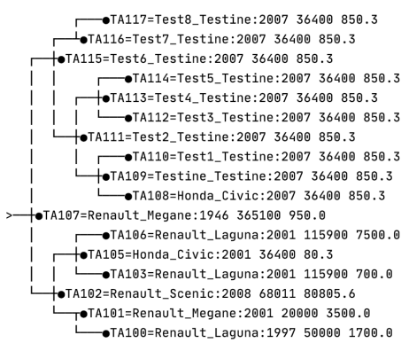

#### LEFT pasukimo testavimas
Ištrinami *c11, c10, c9* elementai. Jei ištrintas elementas pakeičiamas __dešiniojo
pomedžio mažiausiu elementu__, gautas medis po pasukimo atrodo taip:

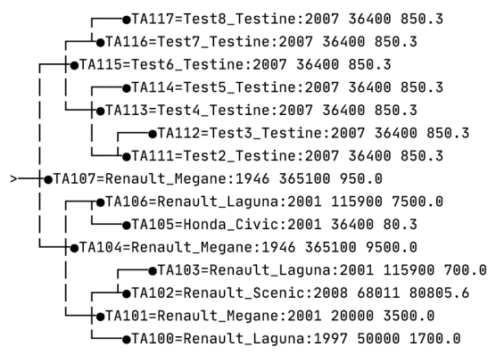

#### RIGHT pasukimo testavimas
Ištrinami *c13, c15, c16* elementai. Jei ištrintas elementas pakeičiamas __kairiojo
pomedžio didžiausiu elementu__, gautas medis po pasukimo atrodo taip:

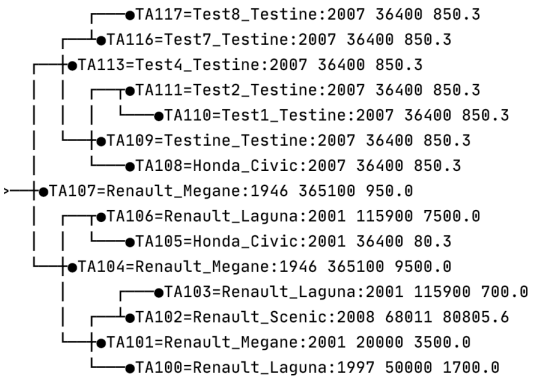
