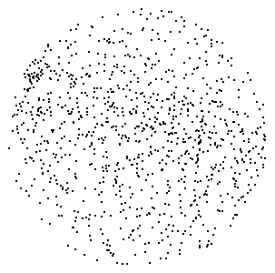
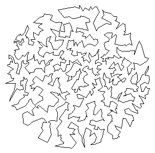

# Technologinis projektas (TP)

## Galimos užduotys

| **Nr.** | **Uždavinys** | **Papildoma informacija** | **Uždavinio autorius** | **Papildomi balai prie egzamino** |
|---|---|---|---|---|
| 1 | [Percolation](https://introcs.cs.princeton.edu/java/assignments/percolation.html) | [Komentarai apie<br>uždavinį ir jo<br>testavimą](https://introcs.cs.princeton.edu/java/assignments/checklist/percolation.html) | Princeton<br>University | 0 |
| 2 | [Global Sequence<br>Allignment](https://introcs.cs.princeton.edu/java/assignments/sequence.html) | [Komentarai apie<br>uždavinį ir jo<br>testavimą](https://introcs.cs.princeton.edu/java/assignments/checklist/sequence.html) | Princeton<br>University | 0 |
| 3 | [Barnes-Hut](https://introcs.cs.princeton.edu/java/assignments/barnes-hut.html) | [Komentarai apie<br>uždavinį ir jo<br>testavimą](https://introcs.cs.princeton.edu/java/assignments/checklist/barnes-hut.html) | Princeton<br>University | 1 |
| 4 | [Particle Collision<br>Simulation](https://introcs.cs.princeton.edu/java/assignments/collisions.html) |  | Princeton<br>University | 1 |
| 5 | [Atomic Nature of<br>Matter](https://introcs.cs.princeton.edu/java/assignments/atomic.html) | [Komentarai apie<br>uždavinį ir jo<br>testavimą](https://introcs.cs.princeton.edu/java/assignments/checklist/atomic.html) | Princeton<br>University | 1 |
| 6 | [Rogue](https://introcs.cs.princeton.edu/java/assignments/rogue.html) | [Komentarai apie<br>uždavinį ir jo<br>testavimą](https://introcs.cs.princeton.edu/java/assignments/checklist/rogue.html) | Princeton<br>University | 1 |
| 7 | [8 Slider Puzzle](https://introcs.cs.princeton.edu/java/assignments/8puzzle.html) | [Komentarai apie<br>uždavinį ir jo<br>testavimą](https://introcs.cs.princeton.edu/java/assignments/checklist/8puzzle.html) | Princeton<br>University | 0 |
| 8 | [Smallest<br>Enclosing Circle](https://introcs.cs.princeton.edu/java/assignments/circle.html) | [Komentarai apie<br>uždavinį ir jo<br>testavimą](https://introcs.cs.princeton.edu/java/assignments/checklist/circle.html) | Princeton<br>University | 1 |
| 9 | [Planar Point<br>Location](https://introcs.cs.princeton.edu/java/assignments/locate.html) | [Komentarai apie<br>uždavinį ir jo<br>testavimą](https://introcs.cs.princeton.edu/java/assignments/checklist/locate.html) | Princeton<br>University | 1 |
| 10 | [Small World<br>Phenomenon](http://www.cs.princeton.edu/courses/archive/spring03/cs226/assignments/bacon.html) |  | Princeton<br>University | 1 |
| 11 | [Map Routing](http://www.cs.princeton.edu/courses/archive/spring04/cos226/assignments/map.html) |  | Princeton<br>University | 1 |
| 12 | [Bin Packing](http://www.cs.princeton.edu/courses/archive/fall06/cos226/assignments/bins.html) |  | Princeton<br>University | 0 |
| 13 | [Travelling<br>Salesperson<br>Problem](http://www.cs.princeton.edu/courses/archive/fall08/cos126/assignments/tsp.html) |  | Princeton<br>University | 0 |
| 14 | [Password<br>Cracking](http://www.cs.princeton.edu/courses/archive/spring03/cs226/assignments/password.html) |  | Princeton<br>University | 1 |
| 15 | [Natural Language<br>Modeling](http://www.cs.princeton.edu/courses/archive/fall08/cos226/assignments/model.html) |  | Princeton<br>University | 1 |
| 16 | [Markovian<br>Candidate](https://introcs.cs.princeton.edu/java/assignments/markovian-candidate.html) | [Komentarai apie<br>uždavinį ir jo<br>testavimą](hhttps://introcs.cs.princeton.edu/java/assignments/checklist/markovian-candidate.html) | Princeton<br>University | 1 |
| 17 | [Word Searching](http://www.cs.princeton.edu/courses/archive/spring04/cos226/assignments/puzzle.html) |  | Princeton<br>University | 1 |
| 18 | [Burrows-Wheeler](http://www.cs.princeton.edu/courses/archive/spring04/cos226/assignments/burrows.html) |  | Princeton<br>University | 1 |

Pastaba: __Prieš pradedant spręsti uždavinį, studentas turi suderinti pasirinktąjį uždavinį su labaratorinių darbų dėstytoju.
Lentelės 2 stulpelyje "Papildomi balai prie egzamino" nurodama, kiek studentas gaus papildomų balų prie būsimo egzamino įvertinimo,
jeigu iš technologinio projekto gynimo gaus 9 arba 10 balų. Jeigu studentui nepavyksta apsiginti darbo nurodytiems balams, papildomi
balai prie egzamino neskiriami.__

## Užduoties struktūra ir metodologiniai nurodymai
1. Pasirinkite ir išspręskite vieną iš Lentelėje pateikiamų uždavinių. __(8/10 balai)__
2. Parenkite laisvos formos ataskaitą __(2/10 balai)__. Ataskaitoje būtinai turi būti:
    1. Užduoties/problemos formuluotė.
    2. Užduoties sprendimo algoritmo aprašymas:
        1. Algoritmas aprašomas tekstu ir pseudokodu arba kodo fragmentu (__visos programos kodo kopijuoti nereikia, pateikiamas tik esminis algoritmas__)
        2. Koks šio algoritmo asimptotinis sudėtingumas?
    3. Duomenų struktūrų, naudojamų uždaviniui spręsti aprašymas:
        1. Kodėl buvo pasirinktos konkrečios duomenų struktūros?
        2. Kokios pasirinktos duomenų struktūros operacijos dominavimo uždavinio sprendime ir kokie šių operacijų asimptotiniai sudėtingumai?
    4. Užduoties sprendimo testavimo aprašymas.
    5. Išvados. Išvadose laisva forma pateikiama:
        1. Apibendrinti darbo rezultatai.
        2. Su užduoties sprendimu susiję pastebėjimai (jeigu buvo).
        3. Jeigu uždavinio sprendima turi trūkumų, ką reikėtų daryti, kad trūkumai būtų pašalinti.

Pasirinkta užduotis:__13. Traveling Salesperson Problem__

# Traveling Salesperson Problem
Given a set of N points in the plane, the goal of a traveling salespersin is to visit all of them, (and arrive back home) while keeping the toal distance traveled as short as possible.
Write a program to compute an approximate solution to the __traveling salesperson problem__ (TSP), and use it to find the shortest tour that you can, connecting a given set of points in the plane.




__Perspective.__ The importance of the TSP does not arise from an overwhelming demand of salespeople to minimize their travel distance, but
rather from a wealth of other applications, many of which seem to have nothing to do with the TSP at first glance. Real world application areas
inlude: vehicle routing, circuit board drilling, VLSI design, robot control, X-ray crystallography, machine scheduling, and computational
biology.

__Greedy heuristics.__ The traveling salesperson problem is a notoriously difficult __combinatorial optimization__ problem, In principle, one can
enumerate all possible tours, but, in practice, the number of tours is so staggeringly large (roughly N factorial) that this appriach is useless.
For large N, no one knows an efficient method that can find the shortest possible tour for any given set of points. However, many methods have
been studied that seem to work well in practice, even though they are not guaranteed to produce the best possible tour. Such methods are called
__heuristics__. Your main task is to implement the __nearest neighbor__ and __smallest increase__ insertion heuristics for building a tour incrementally.
Start with a one-point tour (from the first point back to itself), and iterate the following process untill there are no points left.
 * __Nearest neighbor heuristic__: Read in the next point, and add it to the current tour after the point to which it is closest.
 (If there is more than one point to which it is closest, insert it after the first such point you discover.)
 * __Smallest increase heuristic__: Read in the next point, and add it to the current tour after the point where it results in the least possible increase
 in the tour length. (If there is more than one point, insert it after the first such point you discover.)

 __Point data type.__ You are given a `Point` data type that represents a point in the plane. Each `Point` object can print itself to standard output,
 plot itself using standard draw, plot a line segment from itself to another point, and calculate the Euclidean distance between itself and another point.
 The `Point` class had the following API:
 ```Java
 public class Point (2D point data type)
    Point(double x, double y)   // create the point (x, y)
    String toString()           // return string representation
    void draw()                 // draw point using standard draw
    void drawTo(Point b)        // draw line segment between the two points
    double distanceTo(Point b)  // return Euclidean distance between the two points
 ```
 In the `tsp` directory, there is a class named `Point` which matches the required API.

 __Tour data type__. Next, create a `Tour` data type that represents the sequence of points visited in a TSP tour. Represent the tour as a circular linked
 list of nodes, one for each point. Each `Node` will contain a `Point` and a reference to the next `Node` in the tour. Within `Tour.java`, define a nested
 class `Node` in the standard way.
 ```Java
private class Node {
    private Point p;
    private Node next;

    public Node(Point p) {  // create one Node
        this.p = p;
        this.next = null;
    }
}
 ```

 Each `Tour` object should be able to print its constituent points to standard output, plot its points using standard draw, compute its total distance,
 and insert a new point using either of the two heuristics. Write a class named `Tour` that has the following API:
 ```Java
public class Tour(TSP tour data type)
    Tour()                                      // create an empty tour
    Tour(Point a, Point b, Point c, Point d)    // create a 4 point tour for debugging
    void show()                                 // print the tour to standard output
    void draw()                                 // draw the tour
    double distance()                           // return the total distance of the tour
    void insertSmallest(Point p)                // insert p using smallest insertion heuristic
    void insertNearest(Point p)                 // insert p using nearest neighbor heuristic
 ```

 __Input format__. The input format will begin with two integers `w` and `h`, followed by pairs of real-valued `x` and `y` coordinates.
 All `x` coordinates will be real numbers between `0` and `w`; all `y` coordinates will be real numbers between `0` and `h`. As an example,
 the file [tsp4.txt](ftp://ftp.cs.princeton.edu/pub/cs126/tsp/tsp4.txt) contains the following data
 ```bash
 600 600
532.6531 247.7551
 93.0612 393.6735
565.5102 590.0000
 10.0000  10.0000
 ```

 __Testing__. Many [test data files](ftp://ftp.cs.princeton.edu/pub/cs126/tsp/) are also available. Once you implement `Point` and `Tour`, use the cleint program [NearestInsertion.java](ftp://ftp.cs.princeton.edu/pub/cs126/tsp/NearestInsertion.java) to run the nearest insertion heuristic and print the
 resulting tour and its distance to standard output. Program [SmallestInsertion.java](ftp://ftp.cs.princeton.edu/pub/cs126/tsp/SmallestInsertion.java)
 is analogous but runs the smallest insertion heuristic. Programs [NearestInsertionDraw.java](ftp://ftp.cs.princeton.edu/pub/cs126/tsp/NearestInsertionDraw.java)
 and [SmallestInsetionDraw.java](ftp://ftp.cs.princeton.edu/pub/cs126/tsp/SmallestInsertionDraw.java) are similar but htey also plot the results using
 `StdDraw`. The programs read data from standard input. So, you should invoke as follows.
 ```bash
 % java NearestInsertion < tsp10.txt
 ```

 __Analysis__. Estimate the running time of your program as a function of `N`. Using TSPTimer, run the heuristics for increasing N as long as the
 execution time is less than 100 seconds. (i.e., Start with N = 1000, and repeatedly double N until execution time is over 100 seconds.)